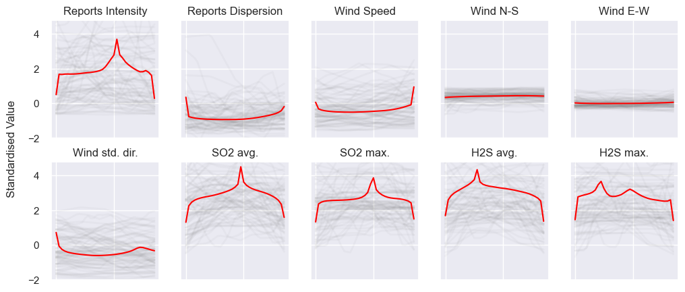

# MSc Data Science - Thesis

## Subsequence Time Series Clustering for Air-Pollution Pattern Recognition

*Author: Oriol Aguilar Larruy*

This research explores the effectiveness of subsequence time series clustering to recognize patterns in environmental data. We employ the Smell Pittsburgh dataset to perform the different experiments and cluster analysis. While most of the related work in subsequence time series clustering focuses on selecting one approach and doing an extensive domain-specific analysis of the findings, this study compares the results of different approaches to determine which one works better. The research employs various approaches encompassing data preparation, segmentation techniques, and time series clustering models. These approaches are evaluated using an internal cluster validation index and a subsequence clustering metric. The findings indicate that TimeSeriesKMeans with Bottom-up segmentation is the most effective approach for identifying insightful patterns, outperforming the more complex models, and allowing us to visualize the temporal dependences of the data.

* **[Code:](./Code/)** scripts and notebooks used for the experiments.
* **[Data:](./Data/)** includes the Smell PGH and External dataset used.
* **[Thesis:](./Thesis_OriolAguilarLarruy.pdf)** Submitted paper.